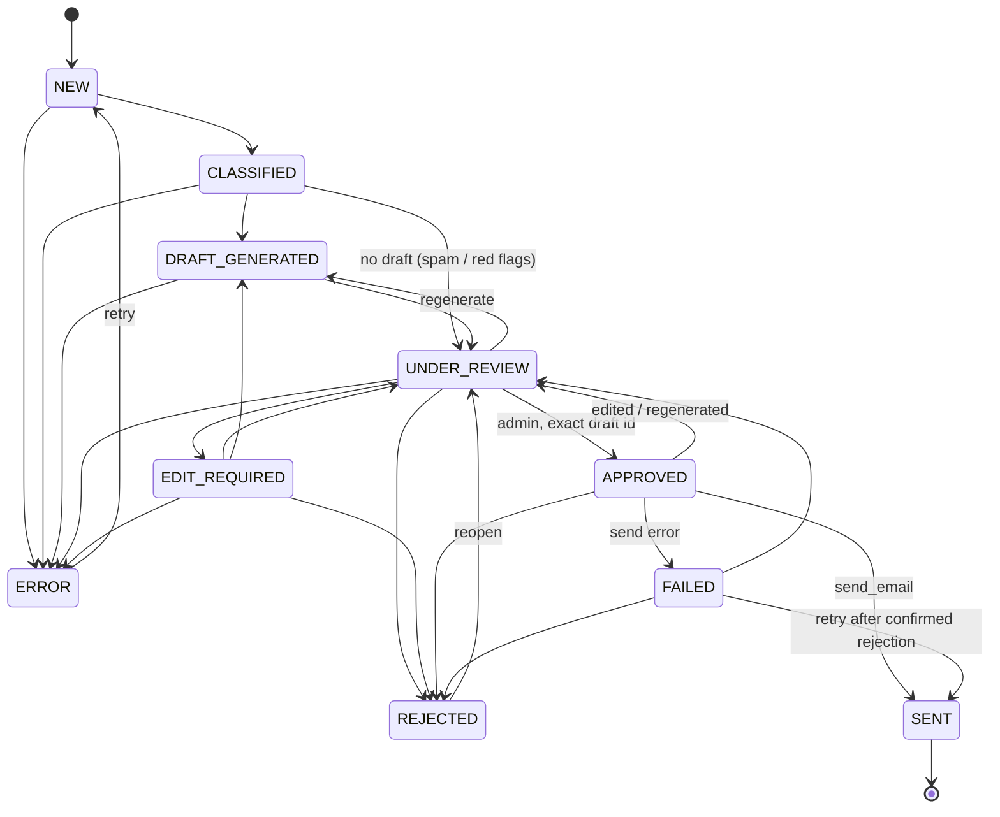

# Architecture

## Pipeline and trust boundaries

```mermaid
flowchart LR
    subgraph Sources["Sources (untrusted)"]
        G[Gmail API<br/>gmail.readonly]
        D[Demo samples<br/>POST /demo/emails]
    end
    G --> I
    D --> I
    subgraph Ingest["Ingestion (no LLM)"]
        I[ingest_email<br/>dedupe on message_id] --> N[clean / HTML to text<br/>hidden text + invisible chars]
        N --> R[rule-based signals<br/>spam, phishing, injection]
        R --> ST[(attachments<br/>content-addressed)]
    end
    R --> DB[(SQLite / PostgreSQL<br/>8 tables, CHECK rules)]
    DB --> P0
    subgraph AI["AI pipeline: POST /emails/id/process"]
        P0[read attachments<br/>PDF text / Tesseract OCR] --> C[classify<br/>+ red_flags]
        C --> X[extract<br/>+ grounding check]
        X --> DR[draft<br/>+ draft warnings]
    end
    C -. prompts: email inside<br/>nonce-delimited untrusted block .-> LLM[(Ollama qwen3:4b<br/>or OpenAI-compatible)]
    X -.-> LLM
    DR -.-> LLM
    DR --> UR{{UNDER_REVIEW}}
    C -- spam / red flags --> UR
    UR --> H[Admin in dashboard<br/>edit / approve / reject / regenerate]
    H -- approve: SHA-256 of exact text --> AP{{APPROVED}}
    AP --> S[send_email<br/>the only send path]
    S -- all checks pass --> OUT[Gmail send<br/>or simulated outbox]
    S --> AU[(audit_logs)]
    H --> AU
```



## Status flow (the single table in `app/workflow/states.py`)



Tests check the key properties of this graph:
- `APPROVED` has exactly one way in, from `UNDER_REVIEW`.
- `SENT` can only be reached through `APPROVED`.
- With `UNDER_REVIEW` removed from the graph, neither `SENT` nor `APPROVED` can be
  reached from `NEW`.

## Layers of protection

| Rule | Where it is enforced |
|---|---|
| Never send without approval | `send_email` is the only send call site (AST test). It requires APPROVED plus an approval hash equal to the SHA-256 of the current draft text. `SEND_MODE` and the demo/prod checks apply on top. |
| No double sends | `send_started_at` is committed before the provider is called. Timeouts and crashes leave the outcome "unknown" and block resending. |
| No invented facts | Extraction values that aren't in the sender's text are removed (`grounding.py`). Numbers, links and commitments in drafts that don't match the email raise warnings. |
| Email is data, never instructions | Per-call nonce delimiters; the system prompt; `red_flags`; rule signals; no automatic draft for flagged emails; human approval. |
| No secrets in code or logs | `.env` + `SecretStr`; token file `0600`; fixed Gmail scopes; redacting logger (secrets and bodies). |
| Human accountability | Every action needs `X-Admin-Name`. Approvals, edits (with diff) and sends are in `audit_logs`, and the DB refuses to delete audit rows. |

## Folder structure

```
email_system/
├── app/
│   ├── main.py               FastAPI app, security headers, dashboard, routers
│   ├── core/                 config, categories, error list, logging
│   ├── db/                   models, UTC types, session, migrate helper
│   ├── ingestion/            IncomingEmail, cleaning, rule signals, storage, service
│   ├── attachments/          PDF text layer + Tesseract OCR with limits
│   ├── llm/                  provider interface, Ollama, OpenAI-compatible, structured
│   ├── pipeline/             prompts, schemas, classify, extract, grounding, draft,
│   │                         draft_checks, attachments step, process, failures
│   ├── workflow/             states (transition table), actions (incl. send_email)
│   ├── sending/              EmailSender, SimulatedSender, GmailSender, factory
│   ├── gmail/                OAuth, sync (raw MIME parser), CLI
│   ├── api/                  emails, dashboard, gmail, demo, deps, errors, schemas
│   ├── static/               dashboard (index.html, app.js, style.css)
│   ├── demo/                 samples.yaml, fixtures (PDF, scanned PDF), CLI loader
│   └── eval/                 real-model evaluation (classify / extract / draft)
├── config/categories.yaml    categories + spam signals (config-driven)
├── migrations/               Alembic
├── tests/                    pytest (mocked LLM/Gmail) + Playwright browser tests
├── docs/                     this file, design review, model choice, Gmail setup,
│                             security review, test results, troubleshooting, eval logs
├── scripts/                  demo fixture generator
├── .env.example  requirements*.txt  pyproject.toml  alembic.ini
```
